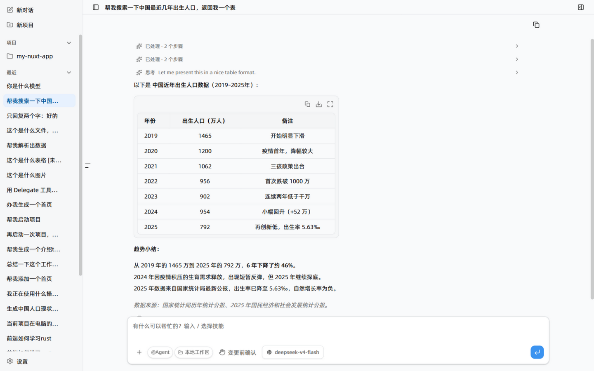
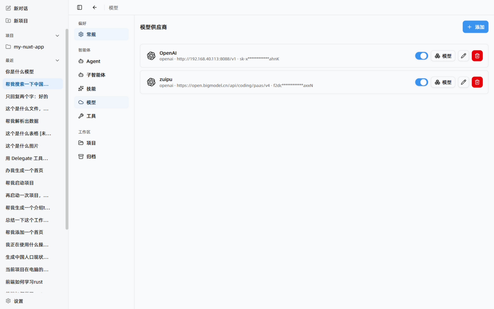
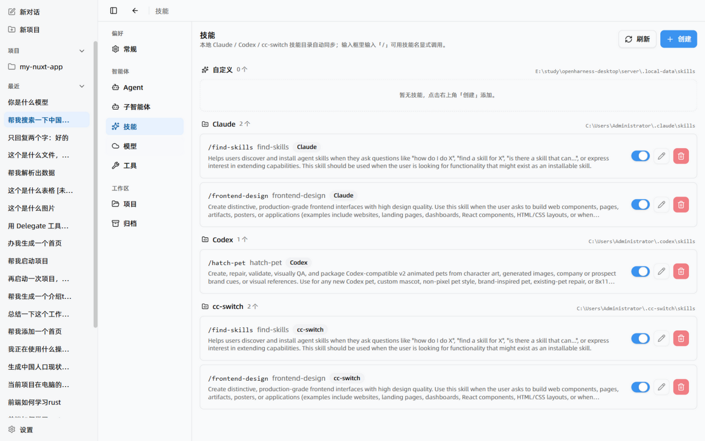

<div align="center">


# Eva Desktop

**本地优先的 AI 智能体桌面客户端**

自带模型 Key，会话、工作区与数据全部留在本机。

[](https://github.com/luabuCN/OpenHarness-Desktop/releases/latest)
[](https://github.com/luabuCN/OpenHarness-Desktop/actions/workflows/ci.yml)


[下载](#下载) · [快速开始](#快速开始) · [功能亮点](#功能亮点) · [技能skills](#技能skills) · [工作原理](#工作原理) · [开发](#开发) · [English](README.en.md)

<br/>



</div>

## Eva Desktop 是什么？

Eva Desktop 把一个可执行工具的 AI 智能体装进了原生桌面应用：读文件、改代码、跑 Git、联网搜索、委派子智能体，每一步都在你眼前进行。没有账号，没有云端中转——连接你自己正在用的模型供应商，会话、设置和 API key 全部保存在本机。

## 功能亮点

- **任意模型，自己的 Key。** 预置 24 家供应商（OpenAI、Anthropic、DeepSeek、智谱、通义、Kimi、硅基流动、OpenRouter、Groq……），或添加任意 OpenAI 兼容接口，也支持 Ollama / LM Studio 等本地网关。可同时配置多家、按会话切换，默认供应商一键设定。
- **会干活的工作区。** 文件浏览与读取、代码编辑、工作区文件变更追踪与 Git 工具；默认「变更前确认」，写入和命令先过你审批。`bash` 工具默认关闭，需要时一键开启。
- **后台子智能体。** 用 Delegate / DelegateWait 把大范围搜索、多文件改动这类可拆分的工作委派给子智能体，它们在自己的上下文里跑完再交报告；遇到需要拍板的问题，智能体会通过 askUser 向你发起选项提问。
- **联网搜索开箱即用。** `webSearch` / `webFetch` 工具无需配置即可用（免 key 走搜狗 / DuckDuckGo），配置 key 后自动升级 Tavily / 博查 / Brave / 智谱。
- **SKILL.md 技能系统。** 输入 `/` 唤起技能菜单；同时自动扫描本机 Claude Code / Codex / cc-switch 的技能目录，模型可按需加载，自定义技能在设置里增删改。
- **项目与会话管理。** 多项目分组的侧边栏，会话与项目支持置顶、归档、重命名。
- **内置浏览器预览面板。** 生成的页面、本地起的服务，直接在应用内预览，不用切窗口。
- **推理等级控制。** 按模型支持情况选择 off / low / medium / high，平衡速度与深度思考。
- **关窗不中断。** 会话运行与客户端连接解耦：关掉窗口任务继续跑，重新打开接上流式输出。
- **本地优先与隐私。** 数据存 SQLite，API 只监听 `127.0.0.1`，API key 只存在于本地 sidecar 进程，不进前端 bundle，无任何遥测。

<table>
  <tr>
    <td width="50%"></td>
    <td width="50%"></td>
  </tr>
  <tr>
    <td align="center"><sub>预置 24 家供应商，填 Base URL 与 Key 即可，同时配置多家按会话切换</sub></td>
    <td align="center"><sub>SKILL.md 技能按来源启停，复用 Claude / Codex / cc-switch 的既有技能</sub></td>
  </tr>
</table>

## 下载

从 [Releases 页面](https://github.com/luabuCN/OpenHarness-Desktop/releases/latest) 获取最新版本。

| 平台 | 安装包 | 说明 |
|---|---|---|
| Windows (x64) | `.msi` / `.exe` | 每个版本随 Release 发布 |
| macOS (Apple Silicon) | `.dmg` | 每个版本随 Release 发布 |
| Linux (x64) | `.deb` / `.AppImage` | 每个版本随 Release 发布 |

> **macOS 提示：** 构建未做开发者签名与公证。若系统拒绝打开，右键选择「打开」，或清除隔离属性：
>
> ```bash
> xattr -cr /Applications/Eva\ Desktop.app
> ```

推送 `v*.*.*` 标签后，GitHub Actions 会自动构建三平台安装包并发布 Release（见 [发布流程](#发布自动出包)）。

## 快速开始

1. **添加模型供应商。** 打开 **设置 → 模型 → 添加供应商**：选一个预置供应商（或 OpenAI Compatible 自定义），粘贴 Base URL 和 API key，填写模型 ID 即可。
2. **开始对话。** 直接描述任务——查资料、改文件、跑搜索都可以；智能体会展示每一步工具调用，写入变更前会先征求确认。
3. **按需扩展。** 输入 `/` 使用技能；需要执行命令时在 `.env` 开启 bash（见下）；想委派任务就让智能体用 Delegate 派给子智能体。

模型供应商配置保存在本地 SQLite，开箱不需要任何环境变量。

### 高级配置（可选 `.env`）

打包后的应用从系统数据目录读取 `.env`（也可以放进数据目录的 `workspace` 同级）：

- Windows: `%APPDATA%/com.openharness.desktop/.env`
- macOS: `~/Library/Application Support/com.openharness.desktop/.env`
- Linux: `~/.config/com.openharness.desktop/.env`

```dotenv
# 允许智能体执行 bash 命令（默认关闭）
OPENHARNESS_ENABLE_BASH=true

# 搜索 API key（Tavily / 博查 / Brave / 智谱，任选其一；缺省时免费抓取搜狗 / DuckDuckGo）
OPENHARNESS_WEBSEARCH_API_KEY=tvly-...
# 强制指定引擎：zhipu / bocha / tavily / brave / sogou / duckduckgo / auto（默认 auto）
OPENHARNESS_WEBSEARCH_ENGINE=auto

# API 监听端口（默认 8878）
OPENHARNESS_PORT=8878
# 上下文窗口大小（默认 128000）
OPENHARNESS_CONTEXT_WINDOW=128000
```

`webSearch` 工具的引擎选择顺序：已配置的**智谱**供应商 key（apiBase 含 `bigmodel.cn`）→ `OPENHARNESS_WEBSEARCH_API_KEY`（按前缀识别：`tvly-` → Tavily、`sk-` → 博查、其余 → Brave）→ 免 key 抓取。

SQLite 数据库、工作区、技能目录都在同一个数据目录下，不会写入安装目录；首次启动自动建表，无需手动迁移。

## 技能（Skills）

采用目录式技能设计，每个技能是一个带 `SKILL.md` 指令文档的文件夹。应用默认扫描本机三个 Agent CLI 的技能目录，外加自己的自定义技能目录（在 **设置 → 技能** 里增删改、按来源整体启停）：

| 来源 | 目录 | 说明 |
| --- | --- | --- |
| 自定义 | `<数据目录>/skills/<id>/SKILL.md` | 在设置里创建，可编辑/删除 |
| Claude | `~/.claude/skills/` | Claude Code 技能（支持符号链接） |
| Codex | `~/.codex/skills/` | Codex 技能 |
| cc-switch | `~/.cc-switch/skills/` | cc-switch 技能 |

启用状态存在 SQLite（`SkillRecord` 表），同名技能按 自定义 > Claude > Codex > cc-switch 的优先级去重。启用后走两条通路：

1. **自动发现**：技能目录注入智能体，模型看到 `<available_skills>` 目录，可通过内置 `skill` / `skill_read` 工具按需加载正文；
2. **显式调用**：输入框输入 `/` 弹出技能菜单，选中后以 `/技能名 参数` 发送；服务端在发给模型的副本里展开技能正文，聊天历史仍保留紧凑的命令文本。

## 安全边界

- API 只监听 `127.0.0.1`，不暴露到网络
- 文件工具被限制在数据目录下的 `workspace`
- bash 工具默认关闭；确需执行命令时设置 `OPENHARNESS_ENABLE_BASH=true`
- API key 只存在于 sidecar 进程，不进入前端 bundle

## 工作原理

Eva Desktop 把界面、智能体运行时和桌面能力分成三层：

- **Web 前端**（`web/`）— Vite + React 的聊天工作台，流式渲染 Markdown / 代码高亮 / Mermaid / 数学公式；
- **Agent sidecar**（`server/`）— Hono + Prisma + SQLite 的 Node 服务，负责智能体循环、模型调用、工具执行与本地数据；打包时编译成 Node 单文件可执行（SEA），随应用分发；
- **Rust 壳**（`src-tauri/`）— Tauri 2 窗口、系统托盘与 sidecar 生命周期管理。

应用启动时 Rust 壳拉起 sidecar 并注入数据目录，前端经本机回环地址通信。会话运行与客户端连接解耦，窗口关闭后任务可后台续跑、重开后恢复流式输出。

## 开发

环境要求：Node.js ≥ 24、pnpm ≥ 11（仓库锁定 `11.22.0`）、Rust 1.88+（仅打包桌面端需要）。

```bash
pnpm install   # 安装依赖并生成 Prisma Client
pnpm dev       # 同时启动 API(8878) + Vite(5173) + Tauri 窗口
```

数据库在 `.local-data/` 下自动创建并建表；只需要 Web 界面调试时可分别运行 `pnpm dev:api` / `pnpm dev:web`。

常用脚本：

| 命令 | 作用 |
| --- | --- |
| `pnpm dev` | 完整桌面开发模式 |
| `pnpm typecheck` | 全 workspace 类型检查（CI 同款） |
| `pnpm build:desktop` | 构建 sidecar 并打包当前平台安装包 |

> **本机代理提示：** `src-tauri/.cargo/config.toml` 已从仓库移除（含本地代理，提交会破坏 CI）。换机器或代理变化时，在本机自建该文件写入 Cargo 代理即可，它已被 `.gitignore` 忽略。

## 发布（自动出包）

CI/CD 全部由 GitHub Actions 完成，无需本地跨平台工具链：

- **CI**（`.github/workflows/ci.yml`）：push / PR 时跑类型检查、Web 构建和 `cargo check`；
- **Release**（`.github/workflows/release.yml`）：推送 `v*.*.*` 标签触发，矩阵构建 Windows MSI/NSIS、macOS DMG、Linux deb/AppImage，标签版本号自动写入产物，最后自动创建 GitHub Release 并生成变更说明。

```bash
git tag v0.2.0
git push origin v0.2.0   # → 三平台安装包约十几分钟后出现在 Release 页
```

标签带预发布后缀（如 `v0.2.0-beta.1`）会自动标记为 prerelease。

## 目录结构

| 目录 | 说明 |
| --- | --- |
| `web/` | Vite + React 前端（聊天 UI、设置、技能菜单） |
| `server/` | Hono + Prisma + SQLite 的 Agent sidecar（智能体运行时、工具、供应商） |
| `src-tauri/` | Tauri 2 Rust 壳（窗口、托盘、sidecar 生命周期） |
| `scripts/` | 开发与打包辅助脚本（SEA sidecar 准备等） |
| `docs/` | 文档与 README 图片 |

## 许可证

尚未指定开源许可证。如果你打算开源，建议尽快添加（MIT / Apache-2.0 等），避免他人默认无权使用。
